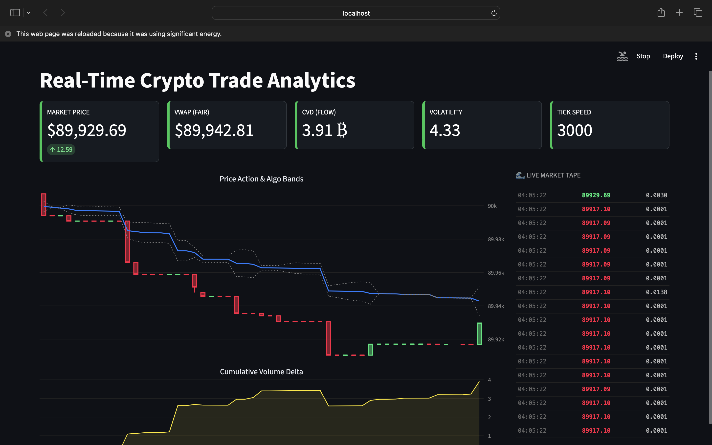

# 📈 Real-Time Crypto Trade Analytics



> **"Data is only valuable if it's timely."** > *Snapshot: A real-time BTC/USDT dashboard visualizing micro-structure market data including VWAP, CVD, and Price Action.*

---

## 🎯 Executive Summary
As a Data Analyst, I wanted to go beyond static datasets and tackle the challenge of **High-Velocity Data**. 

**Real-Time Crypto Trade Analytics** is an end-to-end data engineering and analytics solution that captures live cryptocurrency trades (milliseconds latency), processes them via a Python-SQL pipeline, and delivers actionable market insights in real-time. 

This project demonstrates my ability to handle **ETL processes**, **Database Optimization**, and **Live Visualization**.

---

## 🔍 The Analytical Framework (SQL)
A data pipeline is useless without rigorous analysis. I designed specific SQL modules to validate data integrity and derive market metrics. 

*(All SQL scripts are exported from pgAdmin)*

| Analysis Module | Business Question / Analytical Goal |
| :--- | :--- |
| **`price analysis.sql`** | **Trend Analysis:** Calculating Moving Averages and identifying Support/Resistance zones using raw trade data. |
| **`traffic analysis.sql`** | **Load Testing:** Monitoring trade frequency (Trades Per Second) to assess market volatility and system throughput. |
| **`quality check.sql`** | **Data Governance:** Auditing the pipeline for duplicate entries, null values, and ensuring timestamp consistency. |
| **`total volume stored.sql`** | **Volume Profile:** Aggregating total assets ingested to validate storage accuracy against exchange reports. |
| **`latest trades.sql`** | **Real-Time Audit:** Verifying the latency between trade execution time and database ingestion time. |

---

## 🛠️ Technical Architecture

### 1. Ingestion Layer (`ingest.py`)
* **Source:** Binance WebSocket API (Asyncio).
* **Logic:** Connects to the stream, normalizes JSON payloads, and inserts data into PostgreSQL via robust connection pooling.
* **Why?** To ensure zero data loss during high-volatility events.

### 2. Storage Layer (`schema.sql`)
* **Database:** PostgreSQL (Localhost).
* **Optimization:** Implemented **indexing strategies** on `trade_time` to reduce query execution time for the dashboard.

### 3. Visualization Layer (`app.py`)
* **Tool:** Streamlit & Altair.
* **Metrics:** * **VWAP (Volume Weighted Average Price):** The institutional benchmark for fair value.
    * **CVD (Cumulative Volume Delta):** Analyzing order flow to predict price direction (Buying vs. Selling pressure).

---

## ⚙️ Replication Steps (How to Run)

**Prerequisites:** Python 3.9+, PostgreSQL.

1.  **Clone the Repository:**
    ```bash
    git clone [https://github.com/rabiyahawan789-droid/Real-Time-Crypto-Trade-Analytics.git](https://github.com/rabiyahawan789-droid/Real-Time-Crypto-Trade-Analytics.git)
    ```
2.  **Install Dependencies:**
    ```bash
    pip install -r requirements.txt
    ```
3.  **Database Configuration:**
    * Execute `schema.sql` in pgAdmin to set up the relational structure.
    * Update database credentials in `ingest.py`.
4.  **Execute Pipeline:**
    * Run `python ingest.py` (ETL Process).
    * Run `streamlit run app.py` (Analytics Dashboard).

---

## 💡 Analyst's Note
Building this project taught me that **latency matters**. In financial markets, a 1-second delay in data rendering renders the analysis obsolete. This project bridges the gap between raw engineering and financial insights.

---

## 📬 Connect
**Rabiya Usman**
*Data Analyst*
* [LinkedIn](https://www.linkedin.com/in/rabiya-usman-081bb6263/)
* [GitHub](https://github.com/rabiyahawan789-droid)
